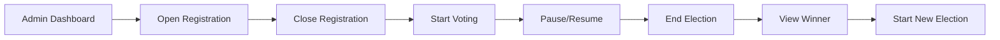
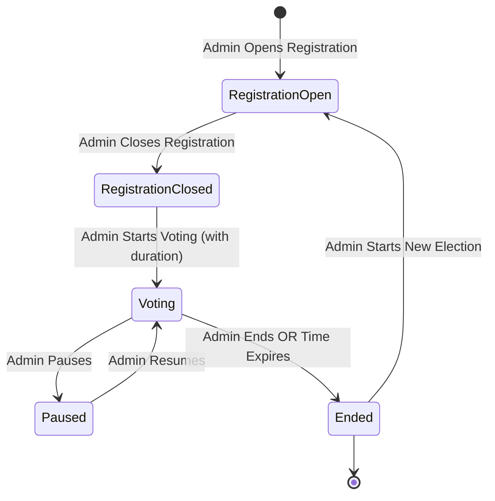

# 🗳️ VoteLedger - Decentralized Voting DAO

<div align="center">


[](https://soliditylang.org/)
[](https://hardhat.org/)
[](https://reactjs.org/)
[](https://vitejs.dev/)
[](https://wagmi.sh/)
[](https://www.rainbowkit.com/)
[](LICENSE)

**A fully decentralized, transparent, and secure voting platform built on blockchain technology**

[Features](#-features) • [Architecture](#-architecture) • [Installation](#-installation) • [Usage](#-usage) • [Smart Contract](#-smart-contract) • [Contributing](#-contributing)

</div>

---

## 📋 Table of Contents

- [Overview](#-overview)
- [Key Features](#-key-features)
- [Technology Stack](#-technology-stack)
- [Architecture](#-architecture)
- [Installation](#-installation)
- [Configuration](#-configuration)
- [Usage Guide](#-usage-guide)
- [Smart Contract Details](#-smart-contract-details)
- [Frontend Implementation](#-frontend-implementation)
- [API Documentation](#-api-documentation)
- [Deployment](#-deployment)
- [Security](#-security)
- [Contributing](#-contributing)
- [License](#-license)

---

## 🌟 Overview

**VoteLedger** is a cutting-edge decentralized voting platform that leverages blockchain technology to ensure transparent, tamper-proof, and secure elections. Built on the **MegaETH Chain**, it provides instant transaction confirmation and real-time updates across all components.

### 🎯 Why VoteLedger?

| Traditional Voting            | VoteLedger                      |
| ----------------------------- | ------------------------------- |
| ❌ Centralized control        | ✅ Fully decentralized          |
| ❌ Opaque processes           | ✅ Complete transparency        |
| ❌ Vulnerable to manipulation | ✅ Blockchain-secured           |
| ❌ Slow result processing     | ✅ Real-time updates            |
| ❌ Limited accessibility      | ✅ Web3 wallet integration      |
| ❌ No audit trail             | ✅ Immutable blockchain records |

---

## ✨ Key Features

### 🔐 **Blockchain Security**

- Smart contracts written in Solidity ^0.8.20
- Deployed on MegaETH Chain (Chain ID: 6342)
- Ownable2Step pattern for secure ownership transfer
- Immutable vote records on blockchain

### ⚡ **Real-Time Updates**

- Event-driven architecture for instant UI updates
- No polling delays - updates in milliseconds
- Cross-page synchronization using custom event bus
- Optimized for MegaETH's fast transaction confirmation

### 👤 **User Features**

```
┌─────────────────────────────────────────────────────┐
│  VOTER REGISTRATION                                 │
│  • Register with name and profile picture          │
│  • IPFS-based profile storage via Pinata          │
│  • One-time registration per wallet                │
└─────────────────────────────────────────────────────┘

┌─────────────────────────────────────────────────────┐
│  CANDIDATE REGISTRATION                             │
│  • Register as a candidate with profile image      │
│  • Visible to all voters during voting phase       │
│  • Vote count tracking on blockchain               │
└─────────────────────────────────────────────────────┘

┌─────────────────────────────────────────────────────┐
│  VOTING SYSTEM                                       │
│  • One vote per registered voter                    │
│  • Anonymous ballot casting                         │
│  • Time-bound voting periods                        │
│  • Instant vote confirmation                        │
└─────────────────────────────────────────────────────┘
```

### 🎨 **Profile Pictures**

- Upload profile pictures (JPG, PNG, GIF, WebP)
- Stored on **IPFS via Pinata** for decentralization
- Max 5MB file size
- Displayed in voting and results sections

### 👑 **Admin Dashboard**



### 🌐 **Multi-Wallet Support**

<div align="center">

| Wallet             | Support |
| ------------------ | ------- |
| 🦊 MetaMask        | ✅      |
| 🌈 Rainbow         | ✅      |
| 💰 Coinbase Wallet | ✅      |
| 🔗 WalletConnect   | ✅      |
| 🔷 Trust Wallet    | ✅      |

</div>

---

## 🛠️ Technology Stack

### **Smart Contract Layer**

```
┌─────────────────────────────────────────────────────┐
│  Solidity ^0.8.20                                   │
│  ├─ VotingDAO Contract                             │
│  ├─ Ownable2Step Pattern                           │
│  └─ Event Emission System                          │
└─────────────────────────────────────────────────────┘
```

### **Blockchain Infrastructure**

```
┌─────────────────────────────────────────────────────┐
│  Hardhat 2.19.0                                     │
│  ├─ Compilation & Testing                          │
│  ├─ Deployment Scripts                             │
│  ├─ Network Configuration                          │
│  └─ Contract Verification                          │
└─────────────────────────────────────────────────────┘
```

### **Frontend Stack**

```
┌─────────────────────────────────────────────────────┐
│  React 18.2.0 + Vite 5.4.21                        │
│  ├─ Component Architecture                          │
│  ├─ State Management                                │
│  └─ Routing System                                  │
└─────────────────────────────────────────────────────┘

┌─────────────────────────────────────────────────────┐
│  Web3 Integration                                    │
│  ├─ Wagmi v2.x - React Hooks for Ethereum          │
│  ├─ Viem v2.x - TypeScript Ethereum Library        │
│  ├─ RainbowKit v2.x - Wallet Connection UI         │
│  └─ TanStack Query v5.x - Data Fetching            │
└─────────────────────────────────────────────────────┘

┌─────────────────────────────────────────────────────┐
│  Styling & UI                                        │
│  ├─ Tailwind CSS 3.3.6                             │
│  ├─ Custom Components                               │
│  └─ Responsive Design                               │
└─────────────────────────────────────────────────────┘
```

### **Storage Layer**

```
┌─────────────────────────────────────────────────────┐
│  IPFS (Pinata)                                      │
│  ├─ Profile Picture Storage                         │
│  ├─ JWT Authentication                              │
│  └─ Gateway Access                                  │
└─────────────────────────────────────────────────────┘
```

---

## 🏗️ Architecture

### **System Architecture Diagram**

```
┌──────────────────────────────────────────────────────────────┐
│                         USER LAYER                           │
│  ┌──────────┐  ┌──────────┐  ┌──────────┐  ┌──────────┐   │
│  │  Voter   │  │Candidate │  │  Admin   │  │ Observer │   │
│  └────┬─────┘  └────┬─────┘  └────┬─────┘  └────┬─────┘   │
└───────┼─────────────┼─────────────┼─────────────┼──────────┘
        │             │             │             │
        ▼             ▼             ▼             ▼
┌──────────────────────────────────────────────────────────────┐
│                    WEB3 WALLET LAYER                         │
│  ┌──────────────────────────────────────────────────────┐   │
│  │  RainbowKit + Wagmi - Multi-Wallet Connection       │   │
│  │  MetaMask | Rainbow | Coinbase | WalletConnect      │   │
│  └──────────────────────────────────────────────────────┘   │
└─────────────────────────┬────────────────────────────────────┘
                          │
                          ▼
┌──────────────────────────────────────────────────────────────┐
│                    FRONTEND LAYER (React)                    │
│  ┌─────────────┐  ┌─────────────┐  ┌─────────────┐         │
│  │    Admin    │  │Registration │  │   Voting    │         │
│  │  Dashboard  │  │    Page     │  │    Page     │         │
│  └──────┬──────┘  └──────┬──────┘  └──────┬──────┘         │
│         │                │                │                  │
│  ┌──────┴─────────────────┴────────────────┴──────┐         │
│  │         Event Bus (Real-time Updates)          │         │
│  └──────────────────────┬──────────────────────────┘         │
└─────────────────────────┼────────────────────────────────────┘
                          │
                          ▼
┌──────────────────────────────────────────────────────────────┐
│                  BLOCKCHAIN LAYER                            │
│  ┌──────────────────────────────────────────────────────┐   │
│  │  MegaETH Chain (Chain ID: 6342)                      │   │
│  │  RPC: https://carrot.megaeth.com/rpc                 │   │
│  │                                                       │   │
│  │  ┌─────────────────────────────────────────────┐    │   │
│  │  │      VotingDAO Smart Contract               │    │   │
│  │  │  ┌──────────┐  ┌──────────┐  ┌──────────┐  │    │   │
│  │  │  │  Voters  │  │Candidates│  │  Votes   │  │    │   │
│  │  │  │  Mapping │  │  Mapping │  │  Mapping │  │    │   │
│  │  │  └──────────┘  └──────────┘  └──────────┘  │    │   │
│  │  └─────────────────────────────────────────────┘    │   │
│  └──────────────────────────────────────────────────────┘   │
└──────────────────────────────────────────────────────────────┘
                          │
                          ▼
┌──────────────────────────────────────────────────────────────┐
│                    STORAGE LAYER                             │
│  ┌──────────────────────────────────────────────────────┐   │
│  │  IPFS (Pinata)                                       │   │
│  │  • Profile Pictures Storage                          │   │
│  │  • Gateway: https://gateway.pinata.cloud/ipfs/      │   │
│  └──────────────────────────────────────────────────────┘   │
└──────────────────────────────────────────────────────────────┘
```

### **Election Lifecycle Flow**



### **Data Flow Diagram**

```
User Action → Transaction Submitted → Blockchain Confirmation
                                              ↓
                      Event Bus Notification ← Transaction Receipt
                                              ↓
                  ┌─────────────┬─────────────┬─────────────┐
                  ▼             ▼             ▼             ▼
            Admin Page    Registration   Voting Page   Results Page
                  │             │             │             │
                  └─────────────┴─────────────┴─────────────┘
                                     ↓
                          All Pages Update in Real-Time
```

---

## 📦 Installation

### **Prerequisites**

```bash
# Required Software
Node.js >= 18.0.0
npm >= 9.0.0
Git
Web3 Wallet (MetaMask, Rainbow, etc.)
```

### **Step 1: Clone Repository**

```bash
git clone https://github.com/Iglxkardam/VoteLedger.git
cd VoteLedger
```

### **Step 2: Install Smart Contract Dependencies**

```bash
cd web3
npm install
```

### **Step 3: Install Frontend Dependencies**

```bash
cd ../client
npm install
```

---

## ⚙️ Configuration

### **1. Smart Contract Configuration**

Create `web3/.env` file:

```env
# MegaETH Network Configuration
MEGAETH_RPC_URL=https://carrot.megaeth.com/rpc
MEGAETH_CHAIN_ID=6342

# Deployment Wallet Private Key (⚠️ KEEP SECRET!)
PRIVATE_KEY=your_private_key_here

# Block Explorer
BLOCK_EXPLORER_URL=https://explorer.carrot.megaeth.com
ETHERSCAN_API_KEY=not-needed
```

### **2. Frontend Configuration**

Create `client/.env` file:

```env
# Contract Configuration
VITE_CONTRACT_ADDRESS=0xYourDeployedContractAddress

# MegaETH Chain Configuration
VITE_CHAIN_ID=6342
VITE_CHAIN_NAME=MegaETH Carrot
VITE_CHAIN_RPC_URL=https://carrot.megaeth.com/rpc
VITE_NATIVE_CURRENCY_NAME=ETH
VITE_NATIVE_CURRENCY_SYMBOL=ETH
VITE_NATIVE_CURRENCY_DECIMALS=18
VITE_BLOCK_EXPLORER_URL=https://explorer.carrot.megaeth.com

# Pinata IPFS Configuration
VITE_PINATA_JWT=your_pinata_jwt_token
VITE_PINATA_API_KEY=your_pinata_api_key
VITE_PINATA_SECRET_KEY=your_pinata_secret_key
VITE_IPFS_GATEWAY=https://gateway.pinata.cloud/ipfs/

# WalletConnect Configuration
VITE_WALLETCONNECT_PROJECT_ID=your_walletconnect_project_id
```

### **3. Get Pinata API Keys**

1. Visit [Pinata Cloud](https://app.pinata.cloud/)
2. Sign up / Log in
3. Go to **API Keys** section
4. Create new API key with **pinFileToIPFS** permission
5. Copy JWT token and API credentials

### **4. Get WalletConnect Project ID**

1. Visit [WalletConnect Cloud](https://cloud.walletconnect.com/)
2. Create a new project
3. Copy the Project ID

---

## 🚀 Usage Guide

### **Deploy Smart Contract**

```bash
cd web3

# Compile contract
npx hardhat compile

# Deploy to MegaETH
npx hardhat run scripts/deploy.js --network megaeth

# Accept ownership (if using Ownable2Step)
npx hardhat run scripts/acceptOwnership.js --network megaeth

# Export ABI for frontend
node scripts/exportABI.js
```

### **Start Frontend Development Server**

```bash
cd client
npm run dev
```

The application will be available at `http://localhost:3000`

### **Build for Production**

```bash
cd client
npm run build
```

---

## 📱 User Guide

### **For Voters**

#### **Step 1: Connect Wallet**

```
1. Click "Connect Wallet" button
2. Choose your preferred wallet
3. Approve the connection
4. Ensure you're on MegaETH Chain (6342)
```

#### **Step 2: Register as Voter**

```
1. Navigate to "Registration" tab
2. Click "Register as Voter"
3. Enter your full name
4. (Optional) Upload profile picture (max 5MB)
5. Click "Register as Voter"
6. Approve transaction in wallet
7. Wait for confirmation (instant on MegaETH)
```

#### **Step 3: Cast Vote**

```
1. Wait for admin to start voting period
2. Navigate to "Vote" tab
3. View all candidates with profiles
4. Select your preferred candidate
5. Click "Submit Vote"
6. Approve transaction
7. Confirmation appears instantly
```

#### **Step 4: View Results**

```
1. After voting ends
2. Navigate to "Results" tab
3. View winner with profile picture
4. See complete vote distribution
5. All data is on blockchain (transparent)
```

### **For Candidates**

```
1. Connect wallet
2. Go to "Registration" → "Register as Candidate" tab
3. Enter your name
4. Upload profile picture (recommended)
5. Submit registration
6. Your profile will appear in voting section
```

### **For Admins (Contract Owner)**

#### **Admin Dashboard Access**

```
✅ Only contract owner sees Admin Dashboard
✅ Located in top navigation
✅ Complete control over election lifecycle
```

#### **Election Management Workflow**

```
┌─────────────────────────────────────────────────────────┐
│  STEP 1: Start New Election                            │
│  • Click "Start New Election"                           │
│  • Opens registration for voters & candidates           │
└─────────────────────────────────────────────────────────┘
                          ↓
┌─────────────────────────────────────────────────────────┐
│  STEP 2: Close Registration                             │
│  • Wait for voters/candidates to register              │
│  • Click "Close Registration"                           │
│  • Locks candidate list                                 │
└─────────────────────────────────────────────────────────┘
                          ↓
┌─────────────────────────────────────────────────────────┐
│  STEP 3: Start Voting                                   │
│  • Set voting duration (in hours)                       │
│  • Click "Start Voting"                                 │
│  • Timer starts counting down                           │
└─────────────────────────────────────────────────────────┘
                          ↓
┌─────────────────────────────────────────────────────────┐
│  STEP 4 (Optional): Pause/Resume                        │
│  • Click "Pause Election" if needed                     │
│  • Voting halts temporarily                             │
│  • Click "Resume Election" to continue                  │
└─────────────────────────────────────────────────────────┘
                          ↓
┌─────────────────────────────────────────────────────────┐
│  STEP 5: End Election                                   │
│  • Click "End Election" or wait for timer              │
│  • Winner calculated automatically                      │
│  • Results published on blockchain                      │
└─────────────────────────────────────────────────────────┘
                          ↓
┌─────────────────────────────────────────────────────────┐
│  STEP 6: View Results & Start New Cycle                │
│  • Check "Results" tab for winner                       │
│  • Start new election when ready                        │
│  • Previous data remains on blockchain                  │
└─────────────────────────────────────────────────────────┘
```

---

## 📜 Smart Contract Details

### **Contract: VotingDAO**

```solidity
// SPDX-License-Identifier: MIT
pragma solidity ^0.8.20;

contract VotingDAO {
    // Ownership
    address public owner;

    // Election Status
    enum Status {
        RegistrationOpen,
        RegistrationClosed,
        Voting,
        Paused,
        Ended
    }

    // Data Structures
    struct Voter {
        bool isRegistered;
        bool hasVoted;
        address votedFor;
        string name;
        string profilePic;  // IPFS hash
    }

    struct Candidate {
        bool isRegistered;
        uint256 voteCount;
        string name;
        string profilePic;  // IPFS hash
    }
}
```

### **Key Functions**

| Function                              | Access | Description                               |
| ------------------------------------- | ------ | ----------------------------------------- |
| `startRegistration()`                 | Owner  | Opens registration period                 |
| `closeRegistration()`                 | Owner  | Closes registration                       |
| `startVoting(uint256)`                | Owner  | Starts voting with duration               |
| `pauseElection()`                     | Owner  | Pauses ongoing voting                     |
| `restartVoting(uint256)`              | Owner  | Resumes voting                            |
| `endElection()`                       | Owner  | Ends election & calculates winner         |
| `registerAsVoter(string, string)`     | Public | Register as voter with name & profile     |
| `registerAsCandidate(string, string)` | Public | Register as candidate with name & profile |
| `vote(address)`                       | Public | Cast vote for a candidate                 |
| `getWinner()`                         | Public | Returns winner address                    |
| `getCandidateInfo(address)`           | Public | Get candidate details                     |
| `getVoterInfo(address)`               | Public | Get voter details                         |

### **Events**

```solidity
event VoterRegistered(address indexed voter, string name, string profilePic);
event CandidateRegistered(address indexed candidate, string name, string profilePic);
event Voted(address indexed voter, address indexed candidate);
event OwnershipTransferred(address indexed previousOwner, address indexed newOwner);
event WinnerAnnounced(address indexed winner, uint256 maxVotes);
```

---

## 🎨 Frontend Implementation

### **Component Structure**

```
client/src/
├── components/
│   └── (Reusable UI components)
├── pages/
│   ├── AdminDashboard.jsx    # Admin controls
│   ├── RegistrationPage.jsx  # Voter/Candidate registration
│   ├── VotingPage.jsx         # Voting interface
│   └── ResultsPage.jsx        # Election results
├── hooks/
│   ├── useContractWrite.js    # Write operations
│   └── useElectionStateWagmi.js # Read operations & state
├── config/
│   ├── index.js               # Configuration
│   ├── wagmi.js               # Wagmi setup
│   └── VotingDAO.abi.json     # Contract ABI
├── services/
│   └── pinataService.js       # IPFS upload
├── utils/
│   └── eventBus.js            # Real-time events
└── App.jsx                    # Main application
```

### **Key Hooks**

#### **useContractWrite**

```javascript
const contractMethods = useContractWrite();

// Usage
await contractMethods.registerVoter(name, ipfsHash);
await contractMethods.vote(candidateAddress);
await contractMethods.startVoting(durationInHours);
```

#### **useElectionStateWagmi**

```javascript
const electionState = useElectionStateWagmi();

// State access
electionState.status; // Current election status
electionState.candidates; // Array of candidates
electionState.currentVoter; // Current user info
electionState.isOwner; // Is current user owner?
electionState.totalVotesCast; // Total votes
electionState.refresh(); // Manual refresh
```

### **Event Bus System**

```javascript
// Emit event after transaction
eventBus.emit(EVENTS.CANDIDATE_REGISTERED);

// Listen for events (auto-refresh)
eventBus.on(EVENTS.ELECTION_UPDATED, () => {
  electionState.refresh();
});
```

---

## 🔒 Security

### **Smart Contract Security**

✅ **Ownable2Step Pattern** - Two-step ownership transfer prevents accidental transfers
✅ **Access Control** - Function-level modifiers restrict sensitive operations
✅ **Input Validation** - All inputs validated (name length, addresses, etc.)
✅ **Reentrancy Protection** - No external calls before state changes
✅ **Integer Overflow** - Solidity ^0.8.20 has built-in overflow checks

### **Frontend Security**

✅ **Wallet Validation** - Verify wallet connection before transactions
✅ **Transaction Confirmation** - Wait for blockchain confirmation
✅ **Environment Variables** - Sensitive data in `.env` files (not committed)
✅ **IPFS JWT** - Secure authentication for Pinata uploads

### **Best Practices**

```
⚠️  NEVER commit .env files to Git
⚠️  NEVER share private keys
⚠️  ALWAYS verify contract addresses
⚠️  ALWAYS test on testnet first
⚠️  ALWAYS audit smart contracts before mainnet deployment
```

---

## 📊 Testing

### **Smart Contract Tests**

```bash
cd web3
npx hardhat test
```

### **Frontend Testing**

```bash
cd client
npm run test
```

---

## 🌐 Deployment

### **🚀 Quick Vercel Deployment**

VoteLedger is ready for **one-click deployment** to Vercel!

#### **Prerequisites**

- [ ] Smart contract deployed on MegaETH
- [ ] Pinata API credentials
- [ ] WalletConnect Project ID

#### **Deploy in 3 Steps:**

1. **Import to Vercel**

   - Go to [Vercel Dashboard](https://vercel.com/new)
   - Import your GitHub repository
   - **Framework Preset:** Select **"Vite"** ⚠️ IMPORTANT
   - **Root Directory:** `client`

2. **Add Environment Variables**

   ```env
   VITE_CONTRACT_ADDRESS=your_contract_address
   VITE_CHAIN_ID=6342
   VITE_CHAIN_RPC_URL=https://carrot.megaeth.com/rpc
   VITE_WALLETCONNECT_PROJECT_ID=your_walletconnect_id
   VITE_PINATA_JWT=your_pinata_jwt
   VITE_IPFS_GATEWAY=https://gateway.pinata.cloud/ipfs/
   ```

3. **Deploy!** 🎉

📖 **Detailed Guide:** See [`VERCEL_DEPLOYMENT.md`](./VERCEL_DEPLOYMENT.md) for complete instructions  
⚡ **Quick Reference:** See [`DEPLOYMENT_QUICK_START.md`](./DEPLOYMENT_QUICK_START.md)

#### **Verify Your Deployment:**

```bash
# Run deployment readiness check
node check-deployment.js
```

---

### **Deploy Smart Contract to MegaETH**

```bash
cd web3

# 1. Compile
npx hardhat compile

# 2. Deploy
npx hardhat run scripts/deploy.js --network megaeth

# 3. Note the deployed contract address

# 4. Accept ownership
npx hardhat run scripts/acceptOwnership.js --network megaeth

# 5. Export ABI
node scripts/exportABI.js
```

---

### **Alternative Frontend Deployments**

#### **Netlify**

```bash
cd client
npm run build
# Drag & drop 'dist' folder to Netlify
```

#### **GitHub Pages**

```bash
cd client
npm run build
# Deploy 'dist' folder to gh-pages branch
```

---

## 🤝 Contributing

We welcome contributions! Here's how:

### **Step 1: Fork Repository**

```bash
# Click "Fork" button on GitHub
```

### **Step 2: Create Feature Branch**

```bash
git checkout -b feature/amazing-feature
```

### **Step 3: Make Changes**

```bash
# Make your changes
git add .
git commit -m "Add amazing feature"
```

### **Step 4: Push & Create PR**

```bash
git push origin feature/amazing-feature
# Create Pull Request on GitHub
```

### **Contribution Guidelines**

- Follow existing code style
- Write clear commit messages
- Add tests for new features
- Update documentation
- Ensure all tests pass

---

## 📄 License

This project is licensed under the **MIT License** - see the [LICENSE](LICENSE) file for details.

---

## 👥 Team

Built with ❤️ by the VoteLedger Team

---

## 📞 Support

- 📧 Email: support@votledger.io
- 🐛 Issues: [GitHub Issues](https://github.com/Iglxkardam/VoteLedger/issues)
- 💬 Discussions: [GitHub Discussions](https://github.com/Iglxkardam/VoteLedger/discussions)

---

## 🗺️ Roadmap

### **Phase 1: Core Features** ✅

- [x] Smart contract implementation
- [x] Frontend with Wagmi/RainbowKit
- [x] IPFS profile pictures
- [x] Real-time updates

### **Phase 2: Enhancements** 🚧

- [ ] Multi-language support
- [ ] Advanced analytics dashboard
- [ ] Email notifications
- [ ] Mobile app (React Native)

### **Phase 3: Advanced Features** 📋

- [ ] Delegate voting
- [ ] Quadratic voting
- [ ] DAO governance integration
- [ ] Cross-chain support

---

## 🌟 Star History

[](https://star-history.com/#Iglxkardam/VoteLedger&Date)

---

<div align="center">

### Made with ❤️ and ☕ by VoteLedger Team

**[⬆ Back to Top](#-votledger---decentralized-voting-dao)**

</div>
